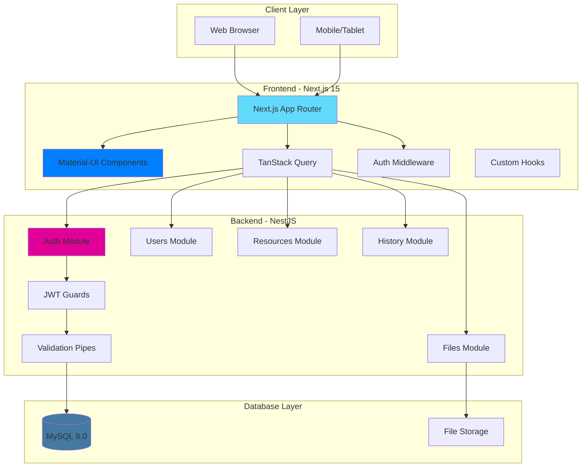

# IRMS System Architecture
## Idle Resource Management System - Hackathon Implementation

## 1. Sơ đồ Kiến trúc Tổng quan



## 2. Technology Stack

### Frontend Stack
```json
{
  "framework": "Next.js 15",
  "ui_library": "Material-UI v7",
  "styling": "Tailwind CSS v4",
  "state_management": "TanStack Query v5",
  "forms": "React Hook Form + Zod",
  "http_client": "Axios",
  "package_manager": "yarn"
}
```

### Backend Stack
```json
{
  "framework": "NestJS 11",
  "database": "MySQL 8.0",
  "orm": "TypeORM 0.3.25",
  "authentication": "JWT",
  "validation": "class-validator",
  "file_processing": "ExcelJS + Multer",
  "password_hashing": "bcrypt"
}
```

### Lý do chọn Technology Stack:
- **Next.js 15**: App Router cho performance tốt, SSR/SSG, built-in optimization
- **Material-UI**: Component library hoàn chỉnh, Argon Dashboard style
- **Tailwind CSS v4**: Utility-first, fast development, easy customization
- **TanStack Query**: Powerful data fetching, caching, synchronization
- **NestJS**: TypeScript-first, modular architecture, enterprise-ready
- **TypeORM**: TypeScript ORM, entity relationships, migrations
- **MySQL**: Reliable, mature, excellent performance for CRUD operations

## 3. Frontend Architecture

### 3.1 Project Structure
```
src/
├── app/                          # Next.js App Router
│   ├── layout.tsx               # Root layout with providers
│   ├── page.tsx                 # Home/redirect page
│   ├── login/                   # S-01-01: Login
│   │   └── page.tsx
│   ├── dashboard/               # S-02-01: Dashboard
│   │   └── page.tsx
│   ├── resources/               # S-03-01: Resource List
│   │   ├── page.tsx
│   │   └── [id]/               # S-04-01: Resource Detail
│   │       └── page.tsx
│   ├── users/                   # S-05-01: User Management
│   │   └── page.tsx
│   └── history/                 # S-06-01: History Log
│       └── page.tsx
├── components/
│   ├── layout/
│   │   ├── DashboardLayout.tsx  # Main layout with sidebar
│   │   ├── Sidebar.tsx          # Left navigation menu
│   │   └── TopBar.tsx           # Header with user menu
│   ├── auth/
│   │   └── LoginForm.tsx        # Login form component
│   ├── resources/
│   │   ├── ResourceTable.tsx    # Data grid with actions
│   │   ├── ResourceForm.tsx     # Create/Edit form
│   │   ├── ResourceFilter.tsx   # Search and filter
│   │   ├── ImportDialog.tsx     # Excel import modal
│   │   └── ExportDialog.tsx     # Export options modal
│   ├── users/
│   │   ├── UserTable.tsx        # User management grid
│   │   └── UserForm.tsx         # User create/edit form
│   ├── dashboard/
│   │   ├── StatsCards.tsx       # Dashboard statistics
│   │   ├── DepartmentChart.tsx  # Department visualization
│   │   └── RecentUpdates.tsx    # Recent activity list
│   ├── common/
│   │   ├── DataGrid.tsx         # Reusable table component
│   │   ├── FileUpload.tsx       # CV upload component
│   │   └── ConfirmDialog.tsx    # Confirmation modal
│   └── ui/                      # Atomic UI components
│       ├── Button.tsx
│       ├── Input.tsx
│       └── Card.tsx
├── hooks/
│   ├── useAuth.ts               # Authentication hook
│   ├── useResources.ts          # Resource data hooks
│   ├── useUsers.ts              # User management hooks
│   └── useFileUpload.ts         # File handling hook
├── lib/
│   ├── api.ts                   # Axios instance + interceptors
│   ├── auth.ts                  # Auth utilities
│   ├── constants.ts             # App constants
│   └── utils.ts                 # Utility functions
├── types/
│   ├── auth.ts                  # Auth type definitions
│   ├── resource.ts              # Resource type definitions
│   └── api.ts                   # API response types
├── styles/
│   └── globals.css              # Tailwind + custom styles
└── middleware.ts                # Route protection
```

### 3.2 Key Frontend Components

#### Layout Architecture
```tsx
// app/layout.tsx - Root Layout with Providers
'use client';
import { QueryClient, QueryClientProvider } from '@tanstack/react-query';
import { ThemeProvider, createTheme } from '@mui/material/styles';
import CssBaseline from '@mui/material/CssBaseline';

const queryClient = new QueryClient();
const theme = createTheme({
  palette: {
    primary: { main: '#1A73E8' },
    secondary: { main: '#49A3F1' },
  },
});

export default function RootLayout({ children }: { children: React.ReactNode }) {
  return (
    <html lang="vi">
      <body>
        <QueryClientProvider client={queryClient}>
          <ThemeProvider theme={theme}>
            <CssBaseline />
            {children}
          </ThemeProvider>
        </QueryClientProvider>
      </body>
    </html>
  );
}
```

#### Authentication Hook
```tsx
// hooks/useAuth.ts
import { useMutation, useQuery } from '@tanstack/react-query';
import { login, logout, validateSession } from '@/lib/api';

export const useAuth = () => {
  const loginMutation = useMutation({
    mutationFn: login,
    onSuccess: (data) => {
      localStorage.setItem('token', data.token);
      localStorage.setItem('user', JSON.stringify(data.user));
    },
  });

  const logoutMutation = useMutation({
    mutationFn: logout,
    onSuccess: () => {
      localStorage.removeItem('token');
      localStorage.removeItem('user');
    },
  });

  const { data: user, isLoading } = useQuery({
    queryKey: ['auth', 'user'],
    queryFn: validateSession,
    enabled: !!localStorage.getItem('token'),
  });

  return {
    user,
    isLoading,
    login: loginMutation.mutate,
    logout: logoutMutation.mutate,
    isAuthenticated: !!user,
  };
};
```

### 3.3 Tailwind CSS v4 Configuration

#### globals.css
```css
/* src/styles/globals.css */
@import "tailwindcss";

/* Argon Dashboard Inspired Styles */
.argon-card {
  background: white;
  border-radius: 0.75rem;
  box-shadow: 0rem 0.25rem 0.375rem -0.0625rem rgba(0, 0, 0, 0.1);
  border: 1px solid rgba(0, 0, 0, 0.05);
}

.argon-button-gradient {
  background: linear-gradient(135deg, #49A3F1 0%, #1A73E8 100%);
  color: white !important;
  border: none;
  font-weight: 500;
  padding: 8px 16px;
  border-radius: 0.5rem;
  transition: all 0.2s ease;
  box-shadow: 0 4px 6px -1px rgba(0, 0, 0, 0.1);
}

.argon-button-gradient:hover {
  transform: translateY(-1px);
  box-shadow: 0 10px 15px -3px rgba(0, 0, 0, 0.1);
}

.argon-sidebar {
  background: linear-gradient(180deg, #1A73E8 0%, #0D47A1 100%);
  color: white;
  width: 250px;
  min-height: 100vh;
}

.argon-table {
  background: white;
  border-radius: 0.75rem;
  overflow: hidden;
  box-shadow: 0rem 0.25rem 0.375rem -0.0625rem rgba(0, 0, 0, 0.1);
}

.urgent-highlight {
  background-color: rgba(255, 235, 59, 0.1);
  border-left: 4px solid #FFC107;
}
```

#### tailwind.config.ts
```typescript
import type { Config } from 'tailwindcss';

const config: Config = {
  content: [
    "./src/pages/**/*.{js,ts,jsx,tsx,mdx}",
    "./src/components/**/*.{js,ts,jsx,tsx,mdx}",
    "./src/app/**/*.{js,ts,jsx,tsx,mdx}",
  ],
  theme: {
    extend: {
      colors: {
        'argon-blue': '#1A73E8',
        'argon-blue-light': '#49A3F1',
        'argon-blue-dark': '#0D47A1',
        'background-gray': '#F8F9FA',
        'border-gray': '#E9ECEF',
        'text-gray': '#495057',
        'urgent-yellow': '#FFC107',
        'success-green': '#28A745',
        'danger-red': '#DC3545',
        'warning-orange': '#FD7E14',
      },
      fontFamily: {
        sans: ['Inter', 'system-ui', 'sans-serif'],
      },
      spacing: {
        '18': '4.5rem',
        '72': '18rem',
        '84': '21rem',
        '96': '24rem',
      },
    },
  },
  plugins: [],
};

export default config;
```

## 4. Backend Architecture

### 4.1 Project Structure
```
src/
├── main.ts                      # Application bootstrap
├── app.module.ts                # Root module
├── auth/                        # Authentication module
│   ├── auth.module.ts
│   ├── auth.controller.ts
│   ├── auth.service.ts
│   ├── dto/
│   │   ├── login.dto.ts
│   │   └── register.dto.ts
│   ├── guards/
│   │   ├── jwt-auth.guard.ts
│   │   └── roles.guard.ts
│   ├── strategies/
│   │   └── jwt.strategy.ts
│   └── decorators/
│       └── roles.decorator.ts
├── users/                       # User management
│   ├── users.module.ts
│   ├── users.controller.ts
│   ├── users.service.ts
│   ├── dto/
│   │   ├── create-user.dto.ts
│   │   └── update-user.dto.ts
│   └── entities/
│       └── user.entity.ts
├── idle-resources/              # Resource management
│   ├── idle-resources.module.ts
│   ├── idle-resources.controller.ts
│   ├── idle-resources.service.ts
│   ├── dto/
│   │   ├── create-resource.dto.ts
│   │   ├── update-resource.dto.ts
│   │   └── search-resource.dto.ts
│   └── entities/
│       └── idle-resource.entity.ts
├── cv-files/                    # File management
│   ├── cv-files.module.ts
│   ├── cv-files.controller.ts
│   ├── cv-files.service.ts
│   ├── dto/
│   │   └── upload-cv.dto.ts
│   └── entities/
│       └── cv-file.entity.ts
├── history-logs/                # Audit trail
│   ├── history-logs.module.ts
│   ├── history-logs.controller.ts
│   ├── history-logs.service.ts
│   ├── dto/
│   │   └── search-history.dto.ts
│   └── entities/
│       └── history-log.entity.ts
├── departments/                 # Department master
│   ├── departments.module.ts
│   ├── departments.controller.ts
│   ├── departments.service.ts
│   └── entities/
│       └── department.entity.ts
├── dashboard/                   # Dashboard aggregation
│   ├── dashboard.module.ts
│   ├── dashboard.controller.ts
│   └── dashboard.service.ts
├── common/                      # Shared utilities
│   ├── decorators/
│   │   └── current-user.decorator.ts
│   ├── filters/
│   │   └── http-exception.filter.ts
│   ├── interceptors/
│   │   └── logging.interceptor.ts
│   └── pipes/
│       └── validation.pipe.ts
└── database/                    # Database configuration
    ├── database.module.ts
    └── migrations/
        └── *.ts
```

### 4.2 Core Backend Modules

#### Authentication Module
```typescript
// auth/auth.service.ts
@Injectable()
export class AuthService {
  constructor(
    @InjectRepository(User)
    private userRepository: Repository<User>,
    private jwtService: JwtService,
  ) {}

  async login(loginDto: LoginDto): Promise<AuthResponse> {
    const { username, password } = loginDto;
    
    const user = await this.userRepository.findOne({
      where: { username },
      relations: ['department'],
    });

    if (!user || !await bcrypt.compare(password, user.password)) {
      throw new UnauthorizedException('Invalid credentials');
    }

    const payload = {
      sub: user.id,
      username: user.username,
      role: user.role,
      departmentId: user.departmentId,
    };

    return {
      token: this.jwtService.sign(payload),
      user: {
        id: user.id,
        username: user.username,
        email: user.email,
        fullName: user.fullName,
        role: user.role,
        departmentId: user.departmentId,
        departmentName: user.department?.name,
      },
    };
  }
}
```

#### Role-based Guards
```typescript
// auth/guards/roles.guard.ts
@Injectable()
export class RolesGuard implements CanActivate {
  constructor(private reflector: Reflector) {}

  canActivate(context: ExecutionContext): boolean {
    const requiredRoles = this.reflector.getAllAndOverride<UserRole[]>('roles', [
      context.getHandler(),
      context.getClass(),
    ]);

    if (!requiredRoles) {
      return true;
    }

    const { user } = context.switchToHttp().getRequest();
    return requiredRoles.some((role) => user.role === role);
  }
}
```

## 5. Database Design

### 5.1 TypeORM Entity Definitions

```typescript
// entities/user.entity.ts
@Entity('users')
export class User {
  @PrimaryGeneratedColumn()
  id: number;

  @Column({ unique: true, length: 50 })
  username: string;

  @Column({ length: 100 })
  password: string;

  @Column({ unique: true, length: 100 })
  email: string;

  @Column({ length: 100 })
  fullName: string;

  @Column({
    type: 'enum',
    enum: UserRole,
    default: UserRole.VIEWER,
  })
  role: UserRole;

  @Column({ nullable: true })
  departmentId: number;

  @ManyToOne(() => Department, { nullable: true })
  @JoinColumn({ name: 'departmentId' })
  department: Department;

  @Column({ default: true })
  isActive: boolean;

  @CreateDateColumn()
  createdAt: Date;

  @UpdateDateColumn()
  updatedAt: Date;

  @OneToMany(() => IdleResource, resource => resource.createdBy)
  createdResources: IdleResource[];

  @OneToMany(() => IdleResource, resource => resource.updatedBy)
  updatedResources: IdleResource[];
}

// entities/idle-resource.entity.ts
@Entity('idle_resources')
export class IdleResource {
  @PrimaryGeneratedColumn()
  id: number;

  @Column({ unique: true, length: 20 })
  employeeCode: string;

  @Column({ length: 100 })
  fullName: string;

  @Column()
  departmentId: number;

  @ManyToOne(() => Department)
  @JoinColumn({ name: 'departmentId' })
  department: Department;

  @Column({ length: 50 })
  position: string;

  @Column({ length: 100, nullable: true })
  email: string;

  @Column({ type: 'text', nullable: true })
  skillSet: string;

  @Column({ type: 'date' })
  idleFrom: Date;

  @Column({ type: 'date', nullable: true })
  idleTo: Date;

  @Column({
    type: 'enum',
    enum: ResourceStatus,
    default: ResourceStatus.IDLE,
  })
  status: ResourceStatus;

  @Column({ type: 'text', nullable: true })
  processNote: string;

  @Column({ type: 'decimal', precision: 10, scale: 2, nullable: true })
  rate: number;

  @Column()
  createdBy: number;

  @ManyToOne(() => User)
  @JoinColumn({ name: 'createdBy' })
  createdByUser: User;

  @Column()
  updatedBy: number;

  @ManyToOne(() => User)
  @JoinColumn({ name: 'updatedBy' })
  updatedByUser: User;

  @CreateDateColumn()
  createdAt: Date;

  @UpdateDateColumn()
  updatedAt: Date;

  @OneToMany(() => CVFile, cvFile => cvFile.resource)
  cvFiles: CVFile[];

  @OneToMany(() => HistoryLog, log => log.resource)
  historyLogs: HistoryLog[];

  // Virtual field for urgent calculation
  get isUrgent(): boolean {
    const twoMonthsAgo = new Date();
    twoMonthsAgo.setMonth(twoMonthsAgo.getMonth() - 2);
    return this.idleFrom <= twoMonthsAgo;
  }
}
```

### 5.2 Database Migrations

```typescript
// database/migrations/001_initial_schema.ts
export class InitialSchema1703001000000 implements MigrationInterface {
  public async up(queryRunner: QueryRunner): Promise<void> {
    // Create departments table
    await queryRunner.createTable(
      new Table({
        name: 'departments',
        columns: [
          { name: 'id', type: 'int', isPrimary: true, isGenerated: true },
          { name: 'name', type: 'varchar', length: '100' },
          { name: 'code', type: 'varchar', length: '20', isUnique: true },
          { name: 'isActive', type: 'boolean', default: true },
          { name: 'createdAt', type: 'timestamp', default: 'CURRENT_TIMESTAMP' },
          { name: 'updatedAt', type: 'timestamp', default: 'CURRENT_TIMESTAMP ON UPDATE CURRENT_TIMESTAMP' },
        ],
      }),
    );

    // Insert default departments
    await queryRunner.query(`
      INSERT INTO departments (name, code) VALUES 
      ('Information Technology', 'IT'),
      ('Human Resources', 'HR'),
      ('Marketing', 'MKT'),
      ('Sales', 'SALES'),
      ('Finance', 'FIN')
    `);

    // Create users table
    await queryRunner.createTable(/* ... */);
    
    // Create idle_resources table
    await queryRunner.createTable(/* ... */);
  }

  public async down(queryRunner: QueryRunner): Promise<void> {
    await queryRunner.dropTable('idle_resources');
    await queryRunner.dropTable('users');
    await queryRunner.dropTable('departments');
  }
}
```

### 5.3 Database Seeding

```typescript
// database/seeds/initial-data.ts
export async function seedDatabase(): Promise<void> {
  const userRepository = AppDataSource.getRepository(User);
  const departmentRepository = AppDataSource.getRepository(Department);
  const resourceRepository = AppDataSource.getRepository(IdleResource);

  // Create admin user
  const adminUser = userRepository.create({
    username: 'admin',
    password: await bcrypt.hash('Admin123!', 10),
    email: 'admin@company.com',
    fullName: 'System Administrator',
    role: UserRole.ADMIN,
  });
  await userRepository.save(adminUser);

  // Create sample departments (if not exists)
  const itDept = await departmentRepository.findOne({ where: { code: 'IT' } });
  
  // Create sample idle resources
  const sampleResources = [
    {
      employeeCode: 'EMP001',
      fullName: 'Nguyen Van A',
      departmentId: itDept.id,
      position: 'Software Developer',
      email: 'nguyenvana@company.com',
      skillSet: 'Java, Spring Boot, MySQL, React',
      idleFrom: new Date('2024-01-15'),
      status: ResourceStatus.IDLE,
      createdBy: adminUser.id,
      updatedBy: adminUser.id,
    },
    // Add more sample data...
  ];

  for (const resourceData of sampleResources) {
    const resource = resourceRepository.create(resourceData);
    await resourceRepository.save(resource);
  }
}
```

## 6. Authentication & Authorization

### 6.1 JWT Strategy Implementation

```typescript
// auth/strategies/jwt.strategy.ts
@Injectable()
export class JwtStrategy extends PassportStrategy(Strategy) {
  constructor(
    @InjectRepository(User)
    private userRepository: Repository<User>,
  ) {
    super({
      jwtFromRequest: ExtractJwt.fromAuthHeaderAsBearerToken(),
      ignoreExpiration: false,
      secretOrKey: 'your-secret-key', // Fixed for hackathon
    });
  }

  async validate(payload: any) {
    const user = await this.userRepository.findOne({
      where: { id: payload.sub },
      relations: ['department'],
    });

    if (!user || !user.isActive) {
      throw new UnauthorizedException();
    }

    return {
      id: user.id,
      username: user.username,
      role: user.role,
      departmentId: user.departmentId,
      department: user.department,
    };
  }
}
```

### 6.2 Frontend Auth Integration

```typescript
// lib/api.ts
import axios from 'axios';

const api = axios.create({
  baseURL: 'http://localhost:3000/api',
});

// Request interceptor to add auth token
api.interceptors.request.use(
  (config) => {
    const token = localStorage.getItem('token');
    if (token) {
      config.headers.Authorization = `Bearer ${token}`;
    }
    return config;
  },
  (error) => Promise.reject(error)
);

// Response interceptor for error handling
api.interceptors.response.use(
  (response) => response,
  (error) => {
    if (error.response?.status === 401) {
      localStorage.removeItem('token');
      localStorage.removeItem('user');
      window.location.href = '/login';
    }
    return Promise.reject(error);
  }
);

export default api;
```

### 6.3 Route Protection Middleware

```typescript
// middleware.ts
import { NextResponse } from 'next/server';
import type { NextRequest } from 'next/server';

const publicPaths = ['/login'];
const adminOnlyPaths = ['/users'];

export function middleware(request: NextRequest) {
  const { pathname } = request.nextUrl;
  const token = request.cookies.get('token')?.value;

  // Allow public paths
  if (publicPaths.includes(pathname)) {
    return NextResponse.next();
  }

  // Redirect to login if no token
  if (!token) {
    return NextResponse.redirect(new URL('/login', request.url));
  }

  // Admin only paths (simplified check)
  if (adminOnlyPaths.some(path => pathname.startsWith(path))) {
    const userRole = request.cookies.get('userRole')?.value;
    if (userRole !== 'Admin') {
      return NextResponse.redirect(new URL('/dashboard', request.url));
    }
  }

  return NextResponse.next();
}

export const config = {
  matcher: ['/((?!api|_next/static|_next/image|favicon.ico).*)'],
};
```

## 7. File Management System

### 7.1 Backend File Handling

```typescript
// cv-files/cv-files.controller.ts
@Controller('cv-files')
@UseGuards(JwtAuthGuard)
export class CVFilesController {
  constructor(private cvFilesService: CVFilesService) {}

  @Post()
  @UseInterceptors(FileInterceptor('file', {
    storage: diskStorage({
      destination: './uploads/cv-files',
      filename: (req, file, cb) => {
        const filename = `${Date.now()}-${file.originalname}`;
        cb(null, filename);
      },
    }),
    fileFilter: (req, file, cb) => {
      const allowedTypes = ['application/pdf', 'application/msword', 
                           'application/vnd.openxmlformats-officedocument.wordprocessingml.document'];
      cb(null, allowedTypes.includes(file.mimetype));
    },
    limits: { fileSize: 10 * 1024 * 1024 }, // 10MB
  }))
  async uploadCV(
    @UploadedFile() file: Express.Multer.File,
    @Body() uploadDto: UploadCVDto,
    @CurrentUser() user: any,
  ) {
    return this.cvFilesService.uploadCV(file, uploadDto.resourceId, user.id);
  }

  @Get(':id/download')
  async downloadCV(@Param('id') id: number, @Res() res: Response) {
    const cvFile = await this.cvFilesService.findOne(id);
    res.download(cvFile.filePath, cvFile.fileName);
  }
}
```

### 7.2 Frontend File Upload Component

```tsx
// components/common/FileUpload.tsx
import { useCallback } from 'react';
import { useDropzone } from 'react-dropzone';
import { Box, Typography, Button } from '@mui/material';
import { CloudUpload } from '@mui/icons-material';

interface FileUploadProps {
  onFileSelect: (file: File) => void;
  accept?: string;
  maxSize?: number;
}

export const FileUpload = ({ 
  onFileSelect, 
  accept = '.pdf,.doc,.docx',
  maxSize = 10 * 1024 * 1024 
}: FileUploadProps) => {
  const onDrop = useCallback((acceptedFiles: File[]) => {
    if (acceptedFiles.length > 0) {
      onFileSelect(acceptedFiles[0]);
    }
  }, [onFileSelect]);

  const { getRootProps, getInputProps, isDragActive, fileRejections } = useDropzone({
    onDrop,
    accept: {
      'application/pdf': ['.pdf'],
      'application/msword': ['.doc'],
      'application/vnd.openxmlformats-officedocument.wordprocessingml.document': ['.docx'],
    },
    maxSize,
    multiple: false,
  });

  return (
    <Box
      {...getRootProps()}
      className={`p-8 border-2 border-dashed rounded-lg text-center cursor-pointer transition-colors
        ${isDragActive ? 'border-argon-blue bg-blue-50' : 'border-gray-300 hover:border-gray-400'}`}
    >
      <input {...getInputProps()} />
      <CloudUpload className="mx-auto mb-4 text-gray-400" sx={{ fontSize: 48 }} />
      <Typography variant="h6" className="mb-2">
        {isDragActive ? 'Thả file tại đây...' : 'Kéo thả file CV hoặc nhấn để chọn'}
      </Typography>
      <Typography variant="body2" color="text.secondary">
        Hỗ trợ: PDF, DOC, DOCX (tối đa 10MB)
      </Typography>
      {fileRejections.length > 0 && (
        <Typography variant="body2" color="error" className="mt-2">
          File không hợp lệ. Vui lòng chọn file PDF, DOC hoặc DOCX dưới 10MB.
        </Typography>
      )}
    </Box>
  );
};
```

## 8. Dashboard & Data Visualization

### 8.1 Dashboard Service

```typescript
// dashboard/dashboard.service.ts
@Injectable()
export class DashboardService {
  constructor(
    @InjectRepository(IdleResource)
    private resourceRepository: Repository<IdleResource>,
    @InjectRepository(Department)
    private departmentRepository: Repository<Department>,
  ) {}

  async getDashboardData(user: any): Promise<DashboardData> {
    const baseQuery = this.resourceRepository.createQueryBuilder('resource')
      .leftJoinAndSelect('resource.department', 'department');

    // Apply department filter for Managers
    if (user.role === UserRole.MANAGER) {
      baseQuery.where('resource.departmentId = :departmentId', { 
        departmentId: user.departmentId 
      });
    }

    const totalResources = await baseQuery.getCount();

    // Calculate urgent resources (idle >= 2 months)
    const twoMonthsAgo = new Date();
    twoMonthsAgo.setMonth(twoMonthsAgo.getMonth() - 2);
    
    const urgentResources = await baseQuery
      .andWhere('resource.idleFrom <= :twoMonthsAgo', { twoMonthsAgo })
      .getCount();

    // Get department statistics
    const departmentStats = await this.getDepartmentStats(user);

    // Get recent updates
    const recentUpdates = await this.getRecentUpdates(user);

    return {
      totalResources,
      urgentResources,
      departmentStats,
      recentUpdates,
      chartData: this.generateChartData(departmentStats),
    };
  }

  private async getDepartmentStats(user: any) {
    const query = this.resourceRepository.createQueryBuilder('resource')
      .leftJoin('resource.department', 'department')
      .select([
        'department.id as departmentId',
        'department.name as departmentName',
        'COUNT(resource.id) as totalCount',
        'SUM(CASE WHEN resource.idleFrom <= DATE_SUB(NOW(), INTERVAL 2 MONTH) THEN 1 ELSE 0 END) as urgentCount'
      ])
      .groupBy('department.id');

    if (user.role === UserRole.MANAGER) {
      query.where('department.id = :departmentId', { departmentId: user.departmentId });
    }

    return query.getRawMany();
  }
}
```

### 8.2 Dashboard Frontend Component

```tsx
// app/dashboard/page.tsx
'use client';
import { Grid, Paper, Typography, Box } from '@mui/material';
import { useQuery } from '@tanstack/react-query';
import { BarChart, Bar, XAxis, YAxis, CartesianGrid, Tooltip, ResponsiveContainer } from 'recharts';
import { getDashboardData } from '@/lib/api';

export default function DashboardPage() {
  const { data: dashboardData, isLoading } = useQuery({
    queryKey: ['dashboard'],
    queryFn: getDashboardData,
  });

  if (isLoading) return <div>Loading...</div>;

  return (
    <Box className="p-6">
      <Typography variant="h4" className="mb-6 font-semibold">
        Dashboard
      </Typography>
      
      {/* Statistics Cards */}
      <Grid container spacing={3} className="mb-6">
        <Grid item xs={12} md={3}>
          <Paper className="argon-card p-6">
            <Typography variant="h6" color="text.secondary">
              Total Resources
            </Typography>
            <Typography variant="h3" className="font-bold text-argon-blue">
              {dashboardData?.totalResources || 0}
            </Typography>
          </Paper>
        </Grid>
        
        <Grid item xs={12} md={3}>
          <Paper className="argon-card p-6">
            <Typography variant="h6" color="text.secondary">
              Urgent (≥2 months)
            </Typography>
            <Typography variant="h3" className="font-bold text-warning-orange">
              {dashboardData?.urgentResources || 0}
            </Typography>
          </Paper>
        </Grid>
      </Grid>

      {/* Department Chart */}
      <Grid container spacing={3}>
        <Grid item xs={12} lg={8}>
          <Paper className="argon-card p-6">
            <Typography variant="h6" className="mb-4">
              Resources by Department
            </Typography>
            <ResponsiveContainer width="100%" height={300}>
              <BarChart data={dashboardData?.departmentStats}>
                <CartesianGrid strokeDasharray="3 3" />
                <XAxis dataKey="departmentName" />
                <YAxis />
                <Tooltip />
                <Bar dataKey="totalCount" fill="#1A73E8" />
                <Bar dataKey="urgentCount" fill="#FFC107" />
              </BarChart>
            </ResponsiveContainer>
          </Paper>
        </Grid>
        
        <Grid item xs={12} lg={4}>
          <Paper className="argon-card p-6">
            <Typography variant="h6" className="mb-4">
              Recent Updates
            </Typography>
            {dashboardData?.recentUpdates?.map((update, index) => (
              <Box key={index} className="mb-3 pb-3 border-b border-gray-200 last:border-b-0">
                <Typography variant="body2" className="font-medium">
                  {update.resourceName}
                </Typography>
                <Typography variant="caption" color="text.secondary">
                  {update.action} • {new Date(update.timestamp).toLocaleDateString()}
                </Typography>
              </Box>
            ))}
          </Paper>
        </Grid>
      </Grid>
    </Box>
  );
}
```

## 9. Development Setup

### 9.1 Docker Compose (MySQL Only)

```yaml
# docker-compose.yml
version: '3.8'

services:
  mysql:
    image: mysql:8.0
    container_name: irms_mysql
    restart: always
    environment:
      MYSQL_ROOT_PASSWORD: root
      MYSQL_DATABASE: idle_resource_db
      MYSQL_USER: irms_user
      MYSQL_PASSWORD: irms_password
    ports:
      - "3306:3306"
    volumes:
      - mysql_data:/var/lib/mysql
      - ./database/init:/docker-entrypoint-initdb.d
    command: --default-authentication-plugin=mysql_native_password

volumes:
  mysql_data:
```

### 9.2 Package.json Configurations

#### Frontend package.json
```json
{
  "name": "irms-frontend",
  "version": "1.0.0",
  "private": true,
  "scripts": {
    "dev": "next dev -p 3001",
    "build": "next build",
    "start": "next start -p 3001",
    "lint": "next lint"
  },
  "dependencies": {
    "@emotion/react": "^11.14.0",
    "@emotion/styled": "^11.14.1",
    "@hookform/resolvers": "^5.2.1",
    "@mui/icons-material": "^7.2.0",
    "@mui/material": "^7.2.0",
    "@tanstack/react-query": "^5.84.1",
    "@tanstack/react-query-devtools": "^5.84.1",
    "axios": "^1.11.0",
    "next": "15.4.5",
    "react": "19.1.0",
    "react-dom": "19.1.0",
    "react-hook-form": "^7.61.1",
    "recharts": "^2.12.7",
    "react-dropzone": "^14.2.9",
    "papaparse": "^5.4.1",
    "zod": "^4.0.14"
  },
  "devDependencies": {
    "@tailwindcss/postcss": "^4",
    "@types/node": "^20",
    "@types/react": "^19",
    "@types/react-dom": "^19",
    "@types/papaparse": "^5.3.14",
    "eslint": "^8",
    "eslint-config-next": "15.4.5",
    "tailwindcss": "^4",
    "typescript": "^5"
  }
}
```

#### Backend package.json
```json
{
  "name": "irms-backend",
  "version": "1.0.0",
  "description": "Idle Resource Management System Backend",
  "scripts": {
    "build": "nest build",
    "start": "nest start",
    "start:dev": "nest start --watch",
    "start:debug": "nest start --debug --watch",
    "start:prod": "node dist/main",
    "migration:generate": "typeorm-ts-node-commonjs migration:generate",
    "migration:run": "typeorm-ts-node-commonjs migration:run",
    "seed": "ts-node src/database/seeds/run-seeds.ts"
  },
  "dependencies": {
    "@nestjs/common": "^11.0.1",
    "@nestjs/core": "^11.0.1",
    "@nestjs/jwt": "^11.0.1",
    "@nestjs/passport": "^11.0.1",
    "@nestjs/platform-express": "^11.0.1",
    "@nestjs/typeorm": "^11.0.0",
    "bcrypt": "^5.1.0",
    "class-transformer": "^0.5.1",
    "class-validator": "^0.14.0",
    "exceljs": "^4.4.0",
    "multer": "^1.4.5-lts.1",
    "mysql2": "^3.6.0",
    "passport": "^0.7.0",
    "passport-jwt": "^4.0.1",
    "reflect-metadata": "^0.2.2",
    "rxjs": "^7.8.1",
    "typeorm": "^0.3.25"
  },
  "devDependencies": {
    "@nestjs/cli": "^11.0.1",
    "@nestjs/schematics": "^11.0.1",
    "@types/bcrypt": "^5.0.2",
    "@types/express": "^4.17.17",
    "@types/multer": "^1.4.11",
    "@types/node": "^20.3.1",
    "@types/passport-jwt": "^4.0.1",
    "source-map-support": "^0.5.21",
    "ts-loader": "^9.4.3",
    "ts-node": "^10.9.1",
    "tsconfig-paths": "^4.2.0",
    "typescript": "^5.1.3"
  }
}
```

### 9.3 Development Scripts

#### Setup Script
```bash
#!/bin/bash
# setup.sh - Quick development setup

echo "🚀 Setting up IRMS Development Environment..."

# Start MySQL
echo "📦 Starting MySQL..."
docker-compose up -d mysql

# Wait for MySQL to be ready
echo "⏳ Waiting for MySQL to be ready..."
sleep 10

# Setup Backend
echo "🔧 Setting up Backend..."
cd backend
yarn install
yarn migration:run
yarn seed
yarn start:dev &

# Setup Frontend
echo "🎨 Setting up Frontend..."
cd ../frontend
yarn install
yarn dev &

echo "✅ Development environment ready!"
echo "🌐 Frontend: http://localhost:3001"
echo "🔗 Backend: http://localhost:3000"
echo "📊 Database: localhost:3306 (root/root)"
```

## 10. Performance & Security Considerations

### 10.1 Performance Optimizations
- **Database Indexing**: Proper indexes on search fields
- **Query Optimization**: Efficient TypeORM queries with proper joins
- **Pagination**: Implemented on all list views
- **Caching**: React Query for frontend caching
- **File Optimization**: Compressed images, optimized bundles

### 10.2 Security Measures
- **JWT Authentication**: Secure token-based auth
- **Role-based Authorization**: Granular permission system
- **Input Validation**: Comprehensive validation on both ends
- **File Upload Security**: Type and size validation
- **SQL Injection Prevention**: TypeORM parameterized queries
- **XSS Protection**: Input sanitization and CSP headers

### 10.3 Deployment Considerations
- **Environment Variables**: Proper configuration management
- **Database Migrations**: Versioned schema changes
- **Build Optimization**: Production-ready builds
- **Monitoring**: Error tracking and performance monitoring
- **Backup Strategy**: Database backup procedures

## 11. Hackathon Implementation Timeline

### Phase 1 (1 hour): Core Setup
- ✅ Project initialization
- ✅ Database schema creation
- ✅ Authentication system
- ✅ Basic layouts

### Phase 2 (1 hour): Core Features
- ✅ Resource CRUD operations
- ✅ User management (Admin)
- ✅ Dashboard basics
- ✅ File upload system

### Phase 3 (1 hour): Advanced Features
- ✅ Import/Export functionality
- ✅ Search and filtering
- ✅ History logging
- ✅ UI polish and testing

## Kết luận

Architecture này được thiết kế cho hackathon với focus vào:
- **Rapid Development**: Stack quen thuộc, dependencies tối thiểu
- **Scalability**: Modular architecture, clean separation
- **Maintainability**: TypeScript, clear structure, documentation
- **Security**: JWT auth, role-based access, input validation
- **User Experience**: Material-UI, responsive design, performance

Hệ thống sẵn sàng cho implementation trong 3 giờ với đầy đủ chức năng core theo requirement.