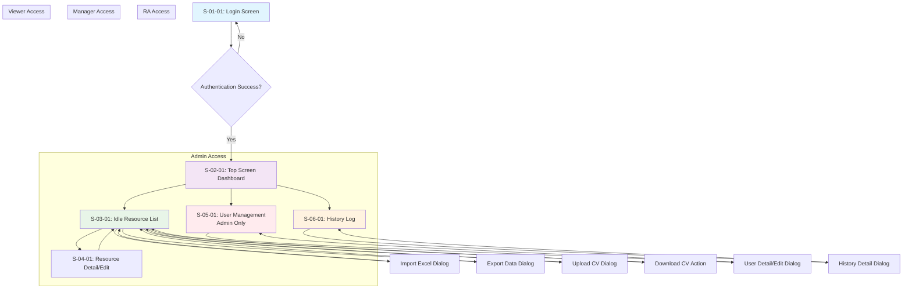

# Tài liệu Thiết kế Cơ bản (Basic Design) - Phần 1
## Hệ thống Quản lý Idle Resource (IRMS)

## Phần 1: Screen List

Dựa vào `Screen List` và `Feature List` từ tài liệu System Requirement Definition, bảng tổng hợp các màn hình:

| ID màn hình | Tên Màn hình | Role có thể sử dụng | Phân cấp Menu | Mô tả các chức năng chính |
|-------------|--------------|-------------------|---------------|---------------------------|
| S-01-01 | Đăng nhập | Tất cả | - | **FR-01**: Đăng nhập hệ thống<br/>**FR-02**: Kiểm tra bảo mật và session timeout |
| S-02-01 | Màn hình chính (Top Screen) | Tất cả | Dashboard | **FR-20**: Tạo báo cáo dashboard<br/>Navigation menu hiển thị theo role |
| S-03-01 | Quản lý danh sách Idle Resource | Admin, RA, MNG, Viewer | Menu > Idle Resource Management | **FR-04**: Thêm mới idle resource<br/>**FR-05**: Cập nhật idle resource<br/>**FR-06**: Cập nhật nhiều idle resource<br/>**FR-07**: Xóa idle resource<br/>**FR-08**: Xóa nhiều idle resource<br/>**FR-09**: Tìm kiếm idle resource<br/>**FR-10**: Ẩn/hiện column trong grid<br/>**FR-11**: Import dữ liệu idle<br/>**FR-12**: Export dữ liệu idle<br/>**FR-13**: Upload CV<br/>**FR-14**: Download CV<br/>**FR-15**: Download nhiều CV<br/>**FR-16**: Highlight resource idle ≥ 2 tháng<br/>**FR-18**: Xem thông tin idle theo bộ phận<br/>**FR-19**: Xem danh sách idle (giới hạn) |
| S-04-01 | Chi tiết/Chỉnh sửa Idle Resource | Admin, RA, MNG | Menu > Idle Resource Management > Detail | **FR-04**: Thêm mới idle resource<br/>**FR-05**: Cập nhật idle resource<br/>**FR-13**: Upload CV<br/>**FR-14**: Download CV |
| S-05-01 | Quản lý người dùng và phân quyền | Admin | Menu > User Management | **FR-03**: Cấp quyền cho các role<br/>Quản lý user accounts và role assignment |
| S-06-01 | Lịch sử cập nhật Idle Resource | Admin, RA, MNG | Menu > History Log | **FR-17**: Lưu lịch sử cập nhật<br/>Xem history log các thay đổi |

## Phần 2: Sơ đồ luồng di chuyển màn hình



### Quy tắc di chuyển màn hình:

1. **Tất cả user** phải qua màn hình Login (S-01-01) trước
2. **Top Screen (S-02-01)** là hub chính với left menu navigation
3. **Role-based access control**:
   - **Admin**: Truy cập tất cả màn hình
   - **RA**: Truy cập S-02-01, S-03-01, S-04-01, S-06-01
   - **Manager**: Truy cập S-02-01, S-03-01, S-04-01, S-06-01 (giới hạn bộ phận)
   - **Viewer**: Chỉ truy cập S-02-01, S-03-01 (giới hạn thông tin)

4. **Navigation Pattern**:
   - Left menu luôn hiển thị (trừ Login screen)
   - Breadcrumb navigation cho deep navigation
   - Modal dialogs cho quick actions (Import, Export, Upload)
   - Detail screens có nút Back to List

### Luồng chính theo Role:

#### Admin Flow:
```
Login → Dashboard → User Management (quản lý user, phân quyền)
Login → Dashboard → Idle Resource List → Resource Detail (full CRUD)
Login → Dashboard → History Log (xem tất cả lịch sử)
```

#### RA Flow:
```
Login → Dashboard → Idle Resource List → Resource Detail (CRUD resource)
Login → Dashboard → Idle Resource List → Import/Export/CV Management
Login → Dashboard → History Log (xem lịch sử resource)
```

#### Manager Flow:
```
Login → Dashboard → Idle Resource List (filter bộ phận) → Resource Detail (view/edit bộ phận)
Login → Dashboard → History Log (lịch sử bộ phận)
```

#### Viewer Flow:
```
Login → Dashboard → Idle Resource List (view only, giới hạn thông tin)
```
