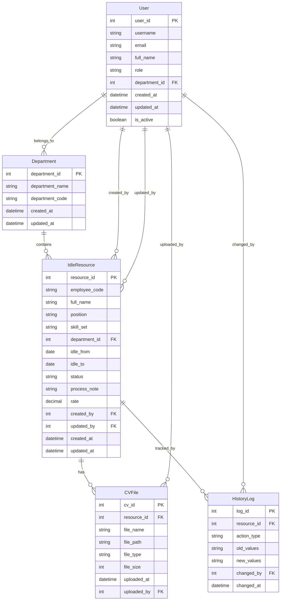
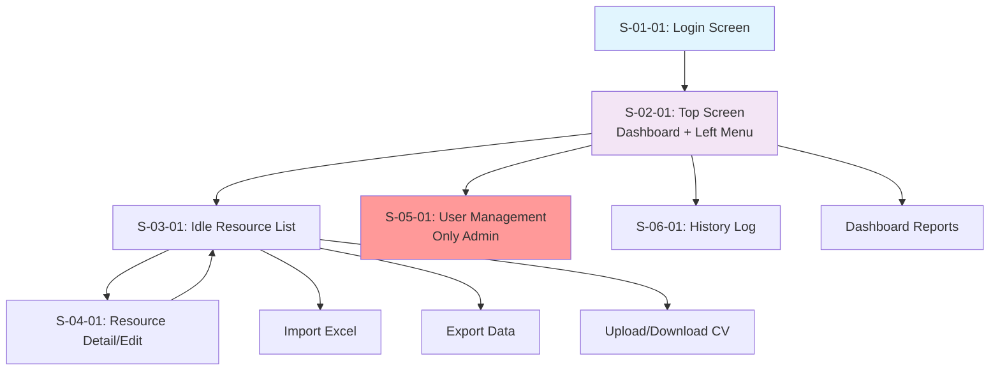

# Tài liệu Định nghĩa Yêu cầu Hệ thống (System Requirement Definition)
## Hệ thống Quản lý Idle Resource (IRMS - Idle Resource Management System)

## 1. Tên hệ thống
**Hệ thống Quản lý Idle Resource (Idle Resource Management System - IRMS)**

## 2. Mục tiêu hệ thống
Xây dựng hệ thống quản lý tài nguyên nhàn rỗi (idle resource) nhằm:
- Theo dõi và quản lý trạng thái nhân sự không có dự án
- Cung cấp báo cáo tình hình idle resource theo phòng ban
- Hỗ trợ quá trình ra quyết định phân bổ nhân sự hiệu quả
- Quản lý CV và thông tin kỹ năng của từng resource

## 3. Vai trò người dùng
- **Admin**: Quản trị hệ thống, cấp quyền cho các role khác, quản lý người dùng
- **RA (Resource Administrator)**: Nhập liệu, import/export, cập nhật thông tin idle resource
  - RA All: Quản lý toàn bộ idle resource của FJP
  - RA bộ phận: Quản lý idle resource của bộ phận cụ thể
- **MNG (Manager)**: Xem thông tin idle và tình trạng xử lý của bộ phận mình
- **Viewer**: Xem danh sách idle toàn FJP (giới hạn một số thông tin nhạy cảm)

## 4. Danh sách chức năng (Feature List)

| Mã chức năng | Mô tả | Đầu vào | Đầu ra | Actor | Ràng buộc/Điều kiện |
|-----|----|---|-----|----|---|
| FR-01 | Đăng nhập hệ thống | Username, Password | Token xác thực, thông tin user | Tất cả | Tài khoản phải tồn tại và active |
| FR-02 | Kiểm tra bảo mật và session timeout | Session token | Session status | System | Session timeout theo cấu hình |
| FR-03 | Cấp quyền cho các role | User ID, Role | Confirmation | Admin | Chỉ Admin có quyền |
| FR-04 | Thêm mới idle resource | Thông tin resource | Resource record | RA, MNG | Thông tin bắt buộc phải đầy đủ |
| FR-05 | Cập nhật idle resource | Resource ID, thông tin cập nhật | Updated record | RA, MNG | Resource phải tồn tại |
| FR-06 | Cập nhật nhiều idle resource | Danh sách Resource IDs, thông tin | Batch update result | RA | Quyền cập nhật theo phạm vi |
| FR-07 | Xóa idle resource | Resource ID | Confirmation | RA | Không thể xóa nếu có liên kết |
| FR-08 | Xóa nhiều idle resource | Danh sách Resource IDs | Batch delete result | RA | Kiểm tra ràng buộc từng record |
| FR-09 | Tìm kiếm idle resource | Search criteria | Filtered results | Tất cả | Kết quả theo quyền truy cập |
| FR-10 | Ẩn/hiện column trong grid | Column settings | Updated view | Tất cả | Lưu preferences theo user |
| FR-11 | Import dữ liệu idle | Excel file | Import result | RA | Validate format và dữ liệu |
| FR-12 | Export dữ liệu idle | Filter criteria | Excel/CSV file | RA, MNG | Theo quyền truy cập dữ liệu |
| FR-13 | Upload CV | CV file (Doc/PDF/Excel) | File reference | RA, MNG | Giới hạn file size và format |
| FR-14 | Download CV | CV ID | CV file | RA, MNG | File phải tồn tại |
| FR-15 | Download nhiều CV | Danh sách CV IDs | ZIP file | RA | Giới hạn số lượng download |
| FR-16 | Highlight resource idle ≥ 2 tháng | Filter criteria | Highlighted view | Tất cả | Tính toán từ Idle From date |
| FR-17 | Lưu lịch sử cập nhật | Resource update | History log | System | Tự động logging |
| FR-18 | Xem thông tin idle theo bộ phận | Department filter | Department data | MNG | Chỉ xem bộ phận của mình |
| FR-19 | Xem danh sách idle (giới hạn) | Filter criteria | Limited data view | Viewer | Ẩn thông tin nhạy cảm |
| FR-20 | Tạo báo cáo dashboard | Filter parameters | Dashboard report | Admin, RA, MNG | Theo quyền truy cập |

## 5. Danh sách các Màn hình cần thiết (Screen List)

| ID      | Loại màn hình                  | Tên màn hình                  | Vai trò sử dụng       | Mô tả/Chức năng chính                                        |
|---------|--------------------------------|-------------------------------|------------------------|--------------------------------------------------------------|
| S-01-01 | Login                         | Đăng nhập                     | Tất cả                | Xác thực người dùng, kiểm tra session timeout |
| S-02-01 | Dashboard + Navigation        | Màn hình chính (Top Screen)   | Tất cả                | Left menu navigation, Dashboard hiển thị overview |
| S-03-01 | List + Filter/Search/CRUD     | Quản lý danh sách Idle Resource | Admin, RA, MNG, Viewer | Xem, tìm kiếm, filter, CRUD operations, import/export |
| S-04-01 | Detail/Form                   | Chi tiết/Chỉnh sửa Idle Resource | Admin, RA, MNG | Form nhập liệu, cập nhật thông tin resource |
| S-05-01 | List + CRUD                   | Quản lý người dùng và phân quyền | Admin | Quản lý user accounts và role assignment |
| S-06-01 | List + Filter                 | Lịch sử cập nhật Idle Resource | Admin, RA, MNG | Xem history log các thay đổi |

**Chú ý quan trọng về Screen List:**  
Trong màn hình S-03-01 chứa nhiều feature như Search, Filter, Import, Export, Add/Edit/Delete resource, Upload/Download CV, vì vậy không nhầm lẫn giữa màn hình và chức năng.

## 6. Danh sách các Batch cần thiết (Batch List)

| ID      | Loại batch      | Tên batch                                | Lịch chạy                | Mô tả chức năng                                  |
|---------|-----------------|------------------------------------------|--------------------------|--------------------------------------------------|
| B-01    | Schedule       | Highlight idle resource ≥ 2 tháng       | Hàng ngày (daily)        | Tự động highlight các resource idle quá 2 tháng |
| B-02    | Schedule       | Session cleanup                          | Hàng giờ (hourly)        | Dọn dẹp các session hết hạn                     |
| B-03    | Manual         | Backup dữ liệu idle resource             | Theo nhu cầu (manual)    | Backup dữ liệu định kỳ                           |

## 7. Danh sách các Report cần thiết (Report List)

| ID      | Định dạng | Tên báo cáo                                    | Mô tả/chức năng                         |
|---------|-----------|------------------------------------------------|-----------------------------------------|
| R-01    | Excel     | Export danh sách idle resource theo filter    | Export dữ liệu idle theo tùy chỉnh      |
| R-02    | CSV       | Báo cáo tình hình idle theo bộ phận           | Dashboard report theo Source            |
| R-03    | CSV       | Báo cáo so sánh với tuần trước                | Baseline data compare với tuần trước    |
| R-04    | ZIP       | Download nhiều CV cùng lúc                    | Nén nhiều file CV thành archive         |

## 8. Danh sách các I/F (liên kết với hệ thống ngoài) cần thiết (I/F List)

| ID      | Loại I/F | Tên I/F                | Hệ thống đích | Mô tả chức năng |
|---------|----------|------------------------|---------------|-----------------|
| IF-01   | File     | Import Excel idle data | File System   | Import dữ liệu từ Excel template |
| IF-02   | File     | CV file management     | File System   | Upload/Download CV files |
| IF-03   | API      | Authentication service | LDAP/AD       | Xác thực người dùng (nếu có) |

## 9. Danh sách các Entity cần thiết và ER diagram

### Entity List:
| ID   | Tên Entity      | Mô tả |
|------|-----------------|-------|
| E-01 | User            | Thông tin người dùng hệ thống |
| E-02 | Department      | Thông tin phòng ban |
| E-03 | IdleResource    | Thông tin tài nguyên nhàn rỗi |
| E-04 | CVFile          | File CV của resource |
| E-05 | HistoryLog      | Lịch sử thay đổi dữ liệu |

### ER Diagram:

## 10. Sơ đồ di chuyển chức năng trong hệ thống

## 11. Luồng nghiệp vụ chính (Main Flows)

### Luồng đăng nhập và phân quyền:
1. **Actor**: Tất cả người dùng
2. **Mục đích**: Truy cập hệ thống với quyền hạn phù hợp
3. **Các bước**:
   - Người dùng nhập username/password
   - Hệ thống xác thực và kiểm tra role
   - Hiển thị Top Screen với menu phù hợp theo role
   - Thiết lập session timeout theo cấu hình

### Luồng quản lý idle resource (RA):
1. **Actor**: RA (Resource Administrator)
2. **Mục đích**: Cập nhật và duy trì thông tin idle resource
3. **Các bước**:
   - Truy cập màn hình Idle Resource List
   - Tìm kiếm/filter resource cần cập nhật
   - Thêm mới hoặc chỉnh sửa thông tin resource
   - Upload CV file nếu cần
   - Lưu thông tin và ghi log lịch sử

### Luồng theo dõi idle resource (Manager):
1. **Actor**: MNG (Manager)
2. **Mục đích**: Theo dõi tình trạng idle resource trong bộ phận
3. **Các bước**:
   - Xem dashboard tổng quan
   - Truy cập danh sách idle resource (filter theo bộ phận)
   - Xem chi tiết resource và process note
   - Cập nhật trạng thái xử lý nếu cần

### Luồng import/export dữ liệu:
1. **Actor**: RA
2. **Mục đích**: Đồng bộ dữ liệu với hệ thống ngoài
3. **Các bước**:
   - Download template Excel
   - Chuẩn bị dữ liệu theo đúng format
   - Import file và kiểm tra validation
   - Xem kết quả import và xử lý lỗi nếu có
   - Export dữ liệu theo filter tùy chỉnh

## 12. Use Case Diagram (mô tả văn bản)

- **Admin có thể**: Đăng nhập, quản lý user và phân quyền, xem tất cả idle resource, xem lịch sử, tạo báo cáo
- **RA có thể**: Đăng nhập, CRUD idle resource, import/export dữ liệu, upload/download CV, xem lịch sử
- **Manager có thể**: Đăng nhập, xem/cập nhật idle resource của bộ phận, xem dashboard, xem lịch sử
- **Viewer có thể**: Đăng nhập, xem danh sách idle resource (giới hạn thông tin nhạy cảm)

## 13. Yêu cầu phi chức năng (Non-functional Requirements)

- **Performance**: 
  - Tốc độ phải hồi dưới 3 giây với 1,000 records mỗi màn hình
  - Hỗ trợ import file Excel tối đa 10,000 records
- **Usability**: 
  - Responsive design hỗ trợ desktop và tablet
  - Grid có thể ẩn/hiện column và cố định column
  - Highlight màu vàng cho resource idle ≥ 2 tháng với icon Urgent
- **Security**: 
  - Mã hóa mật khẩu người dùng
  - Session timeout configurable
  - Role-based access control (RBAC)
  - Audit trail cho tất cả thay đổi dữ liệu
- **Reliability**: 
  - Backup dữ liệu định kỳ
  - Recovery mechanism cho file uploads
- **Compatibility**: 
  - Hỗ trợ browser: Chrome, Firefox, Safari, Edge
  - Hỗ trợ file format: DOC, PDF, Excel cho CV upload

## 14. Checklist Đánh giá đáp ứng tiêu chuẩn IPA Guideline

| Tiêu chí | Trạng thái | Mô tả |
|----|---|----|
| **Tính đầy đủ của yêu cầu chức năng** | ✓ OK | Tất cả 20 chức năng được định nghĩa rõ ràng với input/output/actor |
| **Tính nhất quán của ID** | ✓ OK | Sử dụng naming convention nhất quán (FR-XX, S-XX, B-XX, R-XX, IF-XX, E-XX) |
| **Traceability matrix** | ✓ OK | Có thể trace từ raw requirement → functional requirement → screen → entity |
| **Role-based access control** | ✓ OK | Định nghĩa rõ 4 role với quyền hạn cụ thể |
| **ER Diagram completeness** | ✓ OK | 5 Entity với relationships, PK/FK được định nghĩa đầy đủ |
| **Screen flow clarity** | ✓ OK | Luồng di chuyển giữa 6 màn hình rõ ràng với Mermaid diagram |
| **Business flow documentation** | ✓ OK | 4 luồng nghiệp vụ chính được mô tả chi tiết |
| **Non-functional requirements** | ✓ OK | Đáp ứng performance, security, usability, reliability, compatibility |
| **Batch processing definition** | ✓ OK | 3 batch processes với schedule/manual execution |
| **Interface specification** | ✓ OK | 3 external interfaces được định nghĩa |
| **Report requirements** | ✓ OK | 4 loại report với format cụ thể |
| **Data validation rules** | ⚠️ PARTIAL | Cần bổ sung validation rules chi tiết cho từng field |
| **Error handling specification** | ⚠️ PARTIAL | Cần bổ sung error codes và handling procedures |

### **Các điểm cần lưu ý:**
- Tài liệu này tập trung vào yêu cầu end-user, không đi sâu vào technical architecture
- Tất cả chức năng đều dựa trên raw requirement, không bịa đặt thêm
- ID convention nhất quán để dễ dàng trace và reference trong Basic Design phase
- Role-based access được định nghĩa rõ ràng theo yêu cầu
- Highlight và urgent notification được mô tả cụ thể theo business rule
