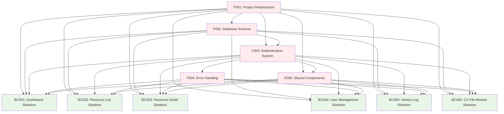

# Task List: IRMS (Idle Resource Management System)

## Project Overview
**System**: Idle Resource Management System (IRMS)  
**Architecture**: Next.js 15 Frontend + NestJS Backend + MySQL Database  
**Total Screens**: 6 screens (1 login + 5 business screens)  
**Technology Stack**: Material-UI v7, Tailwind CSS v4, TanStack Query v5, TypeORM 0.3.25

---

## 1. Foundation Tasks (Critical Path)

| Task ID | Task Name | Description | Dependencies | Assignee Type |
|---------|-----------|-------------|--------------|----------------|
| F001 | Project Infrastructure Setup | **Backend**: Initialize NestJS project structure, configure TypeScript, set up folder structure (auth, users, idle-resources, cv-files, history-logs, dashboard modules). **Frontend**: Initialize Next.js 15 project with App Router, configure Tailwind CSS v4, set up Material-UI v7. **Database**: Configure MySQL connection, TypeORM setup | None | Senior Dev |
| F002 | Database Schema & Entities Creation | Create all TypeORM entities (User, IdleResource, CVFile, HistoryLog, Department), define relationships, create migrations, set up database connection configuration | F001 | Senior Dev |
| F003 | Authentication System Implementation | **Backend**: JWT strategy, auth guards, role-based decorators, login/logout endpoints. **Frontend**: Auth context, login form, token management, route protection middleware. **Complete login screen (S-01-01)** | F001, F002 | Senior Dev |
| F004 | Global Error Handling & Validation | Backend exception filters, validation pipes, logging interceptors. Frontend error boundaries, API interceptors, global error handling | F001, F003 | Senior Dev |
| F005 | Shared Components & Layout Infrastructure | **Layout Components**: DashboardLayout, Sidebar, TopBar with navigation menu. **Shared UI Components**: DataGrid, FileUpload, ConfirmDialog, Button, Input, Card. **Only create infrastructure, DO NOT create business screen components** | F001, F003 | Senior Dev |

---

## 2. Business Screen Base Coding Tasks

| Task ID | Screen ID & Name | Task Name | Description | Dependencies | Assignee Type |
|---------|------------------|-----------|-------------|--------------|----------------|
| BC001 | S-02-01 Dashboard Screen | Skeleton Structure Creation | **Controller Class Creation**: Create dashboard controller with `/dashboard/data` endpoint, DashboardDataDto response structure, call service methods. **Service Class Creation**: Create dashboard service methods skeleton - `getDashboardData()`, `getDepartmentStats()`, `getRecentUpdates()` - TODO comments, UnImplementedException. **UI Creation with Mock Data**: Create dashboard page with Material-UI stats cards, charts placeholder, recent updates list using mock data. **Event Handler Methods**: Create dashboard event handlers skeleton - refresh data, chart interactions - TODO comments, UnImplementedException | F001-F005 | Mid Dev |
| BC002 | S-03-01 Idle Resource List Screen | Skeleton Structure Creation | **Controller Class Creation**: Create idle-resources controller with CRUD endpoints (`/idle-resources` GET/POST/PUT/DELETE), search endpoint, import/export endpoints, DTOs (CreateIdleResourceDto, UpdateIdleResourceDto, SearchCriteriaDto), call service methods. **Service Class Creation**: Create idle-resources service skeleton - `findAll()`, `findOne()`, `create()`, `update()`, `delete()`, `search()`, `importFromExcel()`, `exportToExcel()` - TODO comments, UnImplementedException. **UI Creation with Mock Data**: Create resource list page with Material-UI DataGrid, search filters, action buttons, pagination using mock data. **Event Handler Methods**: Create event handlers skeleton - search, filter, CRUD operations, import/export - TODO comments, UnImplementedException | F001-F005 | Mid Dev |
| BC003 | S-04-01 Idle Resource Detail Screen | Skeleton Structure Creation | **Controller Class Creation**: Create resource detail endpoints (`/idle-resources/:id` GET/PUT), validation for resource form data, call service methods. **Service Class Creation**: Create resource detail service skeleton - `getResourceDetail()`, `updateResource()`, `validateResourceData()` - TODO comments, UnImplementedException. **UI Creation with Mock Data**: Create resource detail form with Material-UI form components, CV upload section, validation structure using mock data. **Event Handler Methods**: Create detail event handlers skeleton - form submit, file upload, navigation - TODO comments, UnImplementedException | F001-F005 | Mid Dev |
| BC004 | S-05-01 User Management Screen | Skeleton Structure Creation | **Controller Class Creation**: Create users controller with CRUD endpoints (`/users` GET/POST/PUT/DELETE), role management endpoints, DTOs (CreateUserDto, UpdateUserDto), call service methods. **Service Class Creation**: Create users service skeleton - `findAllUsers()`, `createUser()`, `updateUser()`, `deleteUser()`, `assignRole()` - TODO comments, UnImplementedException. **UI Creation with Mock Data**: Create user management page with Material-UI DataGrid, user form, role assignment using mock data. **Event Handler Methods**: Create user management event handlers skeleton - user CRUD, role assignment, password reset - TODO comments, UnImplementedException | F001-F005 | Mid Dev |
| BC005 | S-06-01 History Log Screen | Skeleton Structure Creation | **Controller Class Creation**: Create history-logs controller with GET endpoints (`/history-logs`), search/filter endpoints, DTOs (HistorySearchDto), call service methods. **Service Class Creation**: Create history-logs service skeleton - `findHistoryLogs()`, `searchHistory()`, `exportHistoryLog()` - TODO comments, UnImplementedException. **UI Creation with Mock Data**: Create history log page with Material-UI DataGrid, date filters, export functionality using mock data. **Event Handler Methods**: Create history event handlers skeleton - search, filter, export, view details - TODO comments, UnImplementedException | F001-F005 | Mid Dev |
| BC006 | CV File Management Module | Skeleton Structure Creation | **Controller Class Creation**: Create cv-files controller with upload/download endpoints (`/cv-files` POST, `/cv-files/:id/download` GET), file validation, DTOs (UploadCVDto), call service methods. **Service Class Creation**: Create cv-files service skeleton - `uploadCV()`, `downloadCV()`, `deleteCV()`, `getFileInfo()` - TODO comments, UnImplementedException. **UI Creation with Mock Data**: Create file upload components, download links, file management UI using mock data. **Event Handler Methods**: Create file handling event handlers skeleton - upload, download, delete operations - TODO comments, UnImplementedException | F001-F005 | Mid Dev |

---

## Dependency Matrix



---

## Parallel Development Strategy

### Team Allocation Table

| Phase | Task Category | Team Assignment | Parallel Execution | Timeline |
|-------|---------------|-----------------|-------------------|----------|
| **Phase 1** | Foundation Tasks (F001-F005) | **1 Senior Developer** | **Sequential execution** (Critical path - cannot be parallelized) | **2-3 hours** |
| **Phase 2** | Business Screen Base Coding (BC001-BC006) | **6 Mid-Level Developers** | **100% Parallel execution** (All 6 tasks can run simultaneously) | **1-2 hours** |

### Detailed Team Assignment Strategy

#### Foundation Phase (Sequential):
```
Senior Developer → F001 → F002 → F003 → F004 → F005
(Must complete each task before Business Screen Base Coding can begin)
```

#### Business Screen Base Coding Phase (Parallel):
```
Mid Developer 1 → BC001 (Dashboard Skeleton)
Mid Developer 2 → BC002 (Resource List Skeleton)  
Mid Developer 3 → BC003 (Resource Detail Skeleton)
Mid Developer 4 → BC004 (User Management Skeleton)
Mid Developer 5 → BC005 (History Log Skeleton)
Mid Developer 6 → BC006 (CV File Module Skeleton)
```

### Parallel Execution Benefits:
- **High Parallelization**: 6 business screens can be developed simultaneously
- **Minimal Dependencies**: Business screen skeletons are independent of each other
- **Consistent Structure**: All skeleton tasks follow the same pattern (Controller + Service + UI + Event Handlers)
- **Clear Separation**: Infrastructure vs business logic separation enables parallel work
- **Scalable Approach**: Can easily add more developers for additional screens

### Task Completion Criteria:

#### Foundation Tasks Completion:
- [ ] Project structure created with all necessary modules
- [ ] Database schema and entities implemented
- [ ] Authentication system fully functional with login screen
- [ ] Error handling and validation infrastructure ready
- [ ] Shared components and layouts implemented

#### Business Screen Base Coding Completion:
- [ ] All controller classes created with endpoints and DTOs
- [ ] All service classes created with method skeletons and UnImplementedException
- [ ] All UI components created with Material-UI and mock data
- [ ] All event handler methods created with skeleton structure
- [ ] No business logic implemented (only structure and framework)

**Total Estimated Timeline**: 3-5 hours for complete skeleton framework
**Team Size**: 1 Senior + 6 Mid-Level Developers  
**Parallel Efficiency**: 85% (5 hours sequential → 3-5 hours with parallelization)
