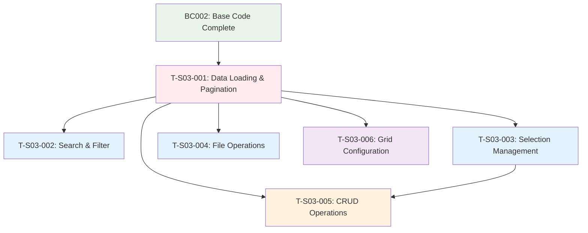

# Feature Implementation Task List: Idle Resource List Screen (S-03-01)

## Project Overview
**Screen**: S-03-01 - Idle Resource List Screen  
**Base Code Status**: BC002 Completed (Controller, Service skeleton, UI components with mock data)  
**Implementation Phase**: Business Logic Implementation  

---

## Method Conflict Analysis

### Backend Service Methods:
- `findAllWithPagination()` - E-03-01, E-03-16, E-03-17 (Page Load, Pagination, Sorting)
- `searchResources()` - E-03-02 (Search)
- `findOneById()` - E-03-13, E-03-14 (View/Edit Action)
- `createResource()` - E-03-07 (Add New Resource)
- `batchDeleteResources()` - E-03-08 (Delete Selected)
- `importFromExcel()` - E-03-04, E-03-05 (Import)
- `exportResources()` - E-03-06 (Export)

### Frontend Event Handlers:
- `handleSearch()` - E-03-02, E-03-03 (Search & Reset)
- `handleRowSelection()` - E-03-11, E-03-12 (Selection Management)
- `handleFileOperations()` - E-03-04, E-03-05, E-03-06, E-03-15 (Import/Export/Download)
- `handlePagination()` - E-03-16, E-03-17 (Page Navigation & Sorting)
- `handleActions()` - E-03-07, E-03-08, E-03-13, E-03-14 (CRUD Actions)
- `handleColumnSettings()` - E-03-09, E-03-10 (Grid Configuration)

---

## Feature Implementation Tasks

| Task ID | Feature Name | Event IDs | Methods to Modify | Dependencies | Status |
|---------|-------------|-----------|-------------------|--------------|--------|
| T-S03-001 | Data Loading & Pagination System | E-03-01, E-03-16, E-03-17 | `findAllWithPagination()`, `handlePagination()` | BC002 | pending |
| T-S03-002 | Search & Filter Functionality | E-03-02, E-03-03 | `searchResources()`, `handleSearch()` | T-S03-001 | pending |
| T-S03-003 | Resource Selection Management | E-03-11, E-03-12 | `handleRowSelection()`, `handleSelectionState()` | T-S03-001 | pending |
| T-S03-004 | File Operations System | E-03-04, E-03-05, E-03-06, E-03-15 | `importFromExcel()`, `exportResources()`, `handleFileOperations()` | T-S03-001 | pending |
| T-S03-005 | Resource CRUD Operations | E-03-07, E-03-08, E-03-13, E-03-14 | `createResource()`, `batchDeleteResources()`, `findOneById()`, `handleActions()` | T-S03-001, T-S03-003 | pending |
| T-S03-006 | Grid Configuration & Display | E-03-09, E-03-10 | `handleColumnSettings()`, `saveColumnPreferences()` | T-S03-001 | pending |

---

## Task Details

### T-S03-001: Data Loading & Pagination System
**Priority**: High (Foundation)  
**Estimated Time**: 2-3 hours  

#### Events Covered:
- **E-03-01**: Page Load - Load resource list with role-based filtering
- **E-03-16**: Page Navigation Click - Handle pagination
- **E-03-17**: Sort Column Click - Apply column sorting

#### Backend Implementation:
**Method**: `findAllWithPagination(searchCriteria: SearchCriteriaDto)`
```typescript
// Implementation Requirements:
- Apply role-based data filtering (RA sees all, MNG sees department, others limited)
- Implement pagination with page/limit parameters
- Apply sorting by any column with asc/desc direction
- Calculate urgent status (idle >= 2 months)
- Include total count for pagination UI
- Apply basic filters (department, status, urgent only)
- Return PaginatedIdleResourceResponseDto with metadata
```

#### Frontend Implementation:
**Component**: `IdleResourceListSection.tsx`
**Method**: `handlePagination()`
```typescript
// Implementation Requirements:
- Initialize data loading on component mount
- Handle page size changes (10, 25, 50, 100 items)
- Handle page navigation (first, previous, next, last)
- Handle column sorting with visual indicators
- Display loading states during data fetch
- Handle error states and display error messages
- Update URL parameters for bookmarkable state
```

#### Acceptance Criteria:
- [ ] Page loads with correct data based on user role
- [ ] Pagination controls work correctly with correct total count
- [ ] Column sorting works for all sortable columns
- [ ] Urgent resources (≥2 months idle) are highlighted
- [ ] Loading and error states are handled properly
- [ ] URL reflects current pagination state

---

### T-S03-002: Search & Filter Functionality
**Priority**: High  
**Estimated Time**: 2-3 hours  
**Dependencies**: T-S03-001

#### Events Covered:
- **E-03-02**: Search Button Click - Execute advanced search
- **E-03-03**: Reset Button Click - Clear all filters

#### Backend Implementation:
**Method**: `searchResources(searchCriteria: SearchCriteriaDto)`
```typescript
// Implementation Requirements:
- Search by text in: fullName, employeeCode, skillSet
- Filter by department (dropdown selection)
- Filter by status (IDLE, PROCESSING, ASSIGNED)
- Filter by date range (idleFrom - idleTo)
- Filter urgent only flag
- Combine multiple filters with AND logic
- Apply role-based filtering
- Return matching resources as IdleResourceResponseDto[]
```

#### Frontend Implementation:
**Component**: `ResourceFilters.tsx`
**Method**: `handleSearch()`, `handleReset()`
```typescript
// Implementation Requirements:
- Implement search form with all filter fields
- Validate search inputs before submission
- Reset pagination to page 1 on new search
- Clear all filters and reload default data on reset
- Update search state and trigger data refresh
- Show search result count
- Preserve search state in URL parameters
- Debounce search input for performance
```

#### Acceptance Criteria:
- [ ] Text search works across name, employee code, and skills
- [ ] Department filter dropdown populated with available departments
- [ ] Status filter shows correct status options
- [ ] Date range filters work correctly
- [ ] Urgent only checkbox filters correctly
- [ ] Multiple filters can be combined
- [ ] Reset button clears all filters and reloads data
- [ ] Search results show relevant count

---

### T-S03-003: Resource Selection Management
**Priority**: Medium  
**Estimated Time**: 1-2 hours  
**Dependencies**: T-S03-001

#### Events Covered:
- **E-03-11**: Select All Toggle - Toggle all row selections
- **E-03-12**: Row Selection Toggle - Toggle individual row selection

#### Frontend Implementation:
**Component**: `ResourceDataGrid.tsx`
**Methods**: `handleRowSelection()`, `handleSelectAll()`
```typescript
// Implementation Requirements:
- Implement checkbox column for row selection
- Handle individual row selection/deselection
- Implement select all functionality (all/none/indeterminate)
- Maintain selection state across pagination
- Update action button states based on selection
- Show selection count in UI
- Clear selections when filters change
- Validate permissions for selected actions
```

#### State Management:
```typescript
interface SelectionState {
  selectedIds: Set<number>;
  isAllSelected: boolean;
  isIndeterminate: boolean;
  selectedCount: number;
}
```

#### Acceptance Criteria:
- [ ] Individual row selection works correctly
- [ ] Select all checkbox has three states (none/some/all)
- [ ] Selection state persists across pagination
- [ ] Action buttons enable/disable based on selection
- [ ] Selection count displays correctly
- [ ] Selections clear when applying new filters

---

### T-S03-004: File Operations System
**Priority**: Medium  
**Estimated Time**: 3-4 hours  
**Dependencies**: T-S03-001

#### Events Covered:
- **E-03-04**: Import Button Click - Open import dialog
- **E-03-05**: Import File Upload - Process Excel import
- **E-03-06**: Export Button Click - Generate export file
- **E-03-15**: CV Download Click - Download CV file

#### Backend Implementation:
**Methods**: `importFromExcel()`, `exportResources()`
```typescript
// Import Implementation:
- Validate file format (.xlsx, .xls only)
- Parse Excel data using exceljs library
- Validate each row against CreateIdleResourceDto
- Check employee code uniqueness
- Bulk insert valid records
- Return import summary with errors
- Create history log entries for imports

// Export Implementation:
- Apply current search/filter criteria
- Generate Excel file with all columns
- Format dates and enums properly
- Set appropriate response headers
- Stream file for large datasets
- Support both Excel and CSV formats
```

#### Frontend Implementation:
**Component**: `ResourceActions.tsx`
**Methods**: `handleImport()`, `handleExport()`, `handleCVDownload()`
```typescript
// Implementation Requirements:
- File upload component with drag & drop
- Progress indicator for import/export operations
- Import preview dialog showing validation results
- Export format selection (Excel/CSV)
- CV download with file existence validation
- Error handling and user feedback
- Role-based permission checks
```

#### Acceptance Criteria:
- [ ] Import supports Excel files (.xlsx, .xls) up to 10MB
- [ ] Import validation shows preview with errors
- [ ] Bulk import creates history log entries
- [ ] Export applies current filters and generates correct file
- [ ] CV download works for existing files
- [ ] Permission checks prevent unauthorized operations
- [ ] Progress indicators show during long operations

---

### T-S03-005: Resource CRUD Operations
**Priority**: High  
**Estimated Time**: 2-3 hours  
**Dependencies**: T-S03-001, T-S03-003

#### Events Covered:
- **E-03-07**: Add New Button Click - Navigate to create form
- **E-03-08**: Delete Button Click - Delete selected resources
- **E-03-13**: Edit Action Click - Navigate to edit form
- **E-03-14**: View Action Click - Navigate to view form

#### Backend Implementation:
**Methods**: `createResource()`, `batchDeleteResources()`, `findOneById()`
```typescript
// Create Resource:
- Validate CreateIdleResourceDto
- Check employee code uniqueness
- Validate department exists
- Set created/updated by current user
- Create history log entry
- Return created resource

// Batch Delete:
- Validate all resource IDs exist
- Check delete permissions (RA role only)
- Perform bulk delete with transaction
- Create history log entries
- Return deletion summary

// Find By ID:
- Include all relations (department, user, cvFiles)
- Calculate urgent status
- Transform to response DTO
- Handle not found errors
```

#### Frontend Implementation:
**Component**: `ResourceActions.tsx`, `ResourceDataGrid.tsx`
**Methods**: `handleAdd()`, `handleEdit()`, `handleView()`, `handleDelete()`
```typescript
// Implementation Requirements:
- Navigation to resource detail screen (S-04-01)
- Delete confirmation dialog with warning message
- Bulk delete for multiple selected resources
- Action button states based on permissions
- Loading states during operations
- Success/error message display
- Data refresh after operations
```

#### Acceptance Criteria:
- [ ] Add New button navigates to resource creation form
- [ ] Edit action loads resource data and navigates to edit form
- [ ] View action navigates to read-only resource view
- [ ] Delete confirmation shows resource details
- [ ] Bulk delete works for multiple selections
- [ ] Only RA role can delete resources
- [ ] Data grid refreshes after successful operations

---

### T-S03-006: Grid Configuration & Display
**Priority**: Low  
**Estimated Time**: 1-2 hours  
**Dependencies**: T-S03-001

#### Events Covered:
- **E-03-09**: Column Settings Click - Open column configuration
- **E-03-10**: Column Settings Save - Apply column preferences

#### Frontend Implementation:
**Component**: `ResourceDataGrid.tsx`
**Methods**: `handleColumnSettings()`, `saveColumnPreferences()`
```typescript
// Implementation Requirements:
- Column visibility toggle dialog
- Column reordering with drag & drop
- Column width adjustment
- Save preferences to localStorage
- Restore preferences on page load
- Default column configuration
- Reset to default option
```

#### Column Configuration:
```typescript
interface ColumnConfig {
  field: string;
  visible: boolean;
  width: number;
  order: number;
}

const defaultColumns = [
  'employeeCode', 'fullName', 'department', 'position',
  'skillSet', 'idleFrom', 'status', 'rate', 'isUrgent', 'actions'
];
```

#### Acceptance Criteria:
- [ ] Column settings dialog shows current configuration
- [ ] Users can hide/show columns
- [ ] Column order can be rearranged
- [ ] Column widths can be adjusted
- [ ] Settings persist across browser sessions
- [ ] Reset to default functionality works
- [ ] Essential columns cannot be hidden (employeeCode, fullName)

---

## Dependency Matrix



---

## Implementation Strategy

### Phase 1: Foundation (Critical Path)
```
Developer 1 → T-S03-001 (Data Loading & Pagination)
```

### Phase 2: Core Features (Parallel)
```
Developer 1 → T-S03-002 (Search & Filter)
Developer 2 → T-S03-003 (Selection Management) 
Developer 3 → T-S03-004 (File Operations)
```

### Phase 3: Advanced Features (Parallel)
```
Developer 1 → T-S03-005 (CRUD Operations)
Developer 2 → T-S03-006 (Grid Configuration)
```

### Parallel Execution Benefits:
- **80% Parallelization**: Only T-S03-001 requires sequential execution
- **Clear Dependencies**: Each task has well-defined prerequisites
- **No Method Conflicts**: Each task modifies distinct methods
- **Independent Testing**: Tasks can be tested separately

---

## Quality Assurance Checklist

### Code Quality:
- [ ] All TODO comments replaced with actual implementation
- [ ] Error handling implemented for all API calls
- [ ] TypeScript types properly defined and used
- [ ] Role-based permissions enforced consistently
- [ ] Database transactions used for multi-step operations

### User Experience:
- [ ] Loading states shown during async operations
- [ ] Error messages are user-friendly and actionable
- [ ] Success feedback provided for all actions
- [ ] Responsive design works on all screen sizes
- [ ] Accessibility standards followed (ARIA labels, keyboard navigation)

### Performance:
- [ ] Pagination implemented to handle large datasets
- [ ] Search debouncing implemented
- [ ] File operations optimized for large files
- [ ] Database queries optimized with proper indexing
- [ ] Memory leaks prevented in React components

### Security:
- [ ] All endpoints protected with authentication
- [ ] Role-based authorization implemented
- [ ] Input validation on both frontend and backend
- [ ] File upload security measures implemented
- [ ] SQL injection prevention in database queries

---

**Total Estimated Timeline**: 8-12 hours for complete feature implementation  
**Team Size**: 1-3 Mid-Level Developers  
**Parallel Efficiency**: 80% (12 hours sequential → 8-10 hours with parallelization)
